# AURA — AI-Native Luxury Fashion Concierge & Agentic Commerce Platform

[](https://ai-growth-agentic-commerce.onrender.com)
[](https://ai-growth-agentic-commerce.onrender.com/.well-known/agent-protocol.json)
[](https://github.com/ChaitanyaJhindal/AI-Growth-Agentic-Commerce-)
[-orange?style=for-the-badge)](https://groq.com)
[](https://www.mongodb.com/atlas)
[-indigo?style=for-the-badge)](https://voyageai.com)

---

## 🌐 Live Deployments & Protocol Discovery Links

| Service / Interface | Live URL | Description |
| :--- | :--- | :--- |
| **🛍️ Production Storefront** | [https://ai-growth-agentic-commerce.onrender.com](https://ai-growth-agentic-commerce.onrender.com) | Conversational Luxury Fashion Concierge & AI Styling Experience |
| **📊 Executive Atelier Admin** | [https://ai-growth-agentic-commerce.onrender.com/admin](https://ai-growth-agentic-commerce.onrender.com/admin) | Real-Time Revenue Analytics, Orders, Patrons & A2A Telemetry |
| **📜 AP2 Agent Discovery Manifest** | [https://ai-growth-agentic-commerce.onrender.com/.well-known/agent-protocol.json](https://ai-growth-agentic-commerce.onrender.com/.well-known/agent-protocol.json) | Machine-readable capability & endpoint manifest for external AI Buyers |
| **🔌 MCP Tool Schema** | [https://ai-growth-agentic-commerce.onrender.com/.well-known/mcp.json](https://ai-growth-agentic-commerce.onrender.com/.well-known/mcp.json) | Model Context Protocol (MCP) declarations for Claude & AutoGPT |
| **📱 WhatsApp QR Pairing** | [https://ai-growth-agentic-commerce.onrender.com/whatsapp](https://ai-growth-agentic-commerce.onrender.com/whatsapp) | Live Baileys Engine QR Scanner & Campaign Dispatcher |
| **💓 Keep-Alive Health Probe** | [https://ai-growth-agentic-commerce.onrender.com/health](https://ai-growth-agentic-commerce.onrender.com/health) | Uptime Monitoring & Health Check Endpoint |

---

## 💎 Executive Summary

> **"Most AI commerce experiences stop at recommendations. AURA goes further: AI agents can discover products, apply bounded discounts, and transact within explicit spending limits."**

**AURA** is an AI-native e-commerce platform built for the emerging **Agentic Commerce** economy. It features a **Dual-Sided Architecture**:
1. **Human-to-AI Luxury Concierge**: Human shoppers interact with a conversational multi-agent stylist that searches 44,000+ fashion pieces via hybrid vector search, resolves budget gaps gracefully, and executes Razorpay in-app checkouts.
2. **Machine-to-Machine (A2A) Autonomous Merchant**: External AI buyers (Claude Desktop via **MCP**, AutoGPT, LangChain agents) can programmatically discover, query, negotiate quotes, and execute bounded checkouts within strict spending authorizations (`max_authorized_budget_inr`).

---

## 🏗️ System Architecture

```mermaid
flowchart TD
    subgraph HumanShopperFlow ["1. Human Conversational Experience (5-Agent LangGraph Workflow)"]
        User([Patron / Shopper]) --> Q[1. Query Agent<br/><b>Groq Key 1 / gpt-oss-120b</b><br/>Intent & INR Budget Parsing]
        Q --> C[2. Context Agent<br/><b>Groq Key 2 / gpt-oss-120b</b><br/>Specificity & Ambiguity Gate]
        
        C -->|Needs Clarification| Clarify[Concierge Clarification Prompt<br/>Max 2 Turns]
        Clarify --> User
        
        C -->|Sufficient Context| S[3. Search Node<br/><b>Voyage AI 512-dim + Atlas</b><br/>Vector Search + Lexical RRF]
        S --> V[4. Validation Agent<br/><b>Groq Key 2 / gpt-oss-120b</b><br/>QA & Budget Floor Upsell]
        
        V -->|Validation Failed| S
        V -->|Validation Passed| U[5. AI Runway Stylist<br/><b>Groq Key 3 / gpt-oss-120b</b><br/>3-Piece Capsule Composition]
        
        U --> Res([Luxury Curated Recommendations & Outfits])
    end

    subgraph A2AProtocolFlow ["2. Machine-to-Machine (A2A) AI Buyer Protocol Layer"]
        AIBuyer([External AI Buyer Agent<br/>AutoGPT / Claude Assistant]) -->|1. Discovery| Manifest[GET /.well-known/agent-protocol.json<br/>GET /.well-known/mcp.json]
        AIBuyer -->|2. Search| PQuery[POST /protocol/v1/catalog/query]
        AIBuyer -->|3. Quote| PQuote[POST /protocol/v1/quote<br/>Applied Vouchers + Math Justification]
        AIBuyer -->|4. Gated Checkout| PCheckout[POST /protocol/v1/order/checkout<br/><b>Strict Spending Gating</b>]
        PCheckout -->|5. Settle & Verify| PVerify[POST /protocol/v1/order/verify<br/>HMAC-SHA256 Signature Verification]
        PVerify --> MongoLedger[(MongoDB Atlas `a2a_orders` Ledger)]
    end

    subgraph GrowthEngine ["3. Autonomous Growth & Retention Loop"]
        AbandonedBags[(MongoDB Uncompleted Bags)] --> CA[6. AI Campaign Agent<br/><b>Groq Key 5 / gpt-oss-20b</b><br/>Hinglish/English Recovery Copy]
        CA --> WQ[(MongoDB `whatsapp_messages` Queue)]
        WQ --> WW[Baileys WhatsApp Worker<br/>Zero Chromium / <35MB RAM]
        WW --> WA([Patron WhatsApp Notification])
    end
```



---

## 💱 Global Currency & Normalization ($1 = ₹50 INR)

* **Normalized Catalog**: Products are cataloged in USD units ($40 USD = ₹2,000 INR).
* **Indian Rupee UI (`₹`)**: 100% of product cards, active filter pills, capsule totals, wardrobe items, and order history are formatted in Indian Rupees using `formatINR()`.
* **Autonomous Budget Reasoning**: When an AI Buyer or human queries in INR (`"running shoes under ₹3000"`), the Query Agent automatically divides by 50 (`max_price = 60.0`) to search the index without requiring destructive database schema migrations.
* **Deterministic Razorpay Orders**: Converted to integer paise (`amount_in_inr * 100`) and cryptographically verified via HMAC-SHA256.

---

## 🛡️ "The Bar": Deterministic Gating, Explainability & Audit Trail

1. **Strict Budget Gating**: External AI buyers specify `max_authorized_budget_inr`. If the computed order total exceeds this limit, the merchant rejects the transaction with HTTP 422 `BUDGET_GATING_VIOLATION` (failure handled gracefully).
2. **Server-Side Price Authority**: Client-side and LLM-proposed prices are untrusted. The backend recalculates subtotals from catalog inventory and validates vouchers against `MERCHANT_PROMO_CODES`.
3. **Budget Gap Graceful Upsell**: When a user queries a price below catalog floor (e.g. *watches under ₹1,000* when minimum is ₹4,000), the Validation Agent catches the gap, returns entry-level pieces, and politely explains the baseline in `₹`.
4. **Complete Audit Trail**: Live Executive Admin Hub (`/admin`) displaying itemized order streams, Razorpay Payment IDs, patron lifetime spend, and A2A autonomous machine acquisitions.

---

## 📁 Repository Structure

```
AI Growth & Agentic Commerce/
├── server.py                     # Primary FastAPI application entrypoint
├── requirements.txt              # Pinned Python dependencies
├── package.json                  # Node.js dependencies for Baileys WhatsApp worker
├── render.yaml                   # Infrastructure-as-Code for Render Cloud deployment
├── render-build.sh               # Fast build script for Python & Node runtimes
│
├── src/
│   ├── config.py                 # Environment variables & distributed Groq key routing
│   ├── auth.py                   # PBKDF2-HMAC-SHA256 auth, cart & order persistence
│   ├── payments.py               # Razorpay order creation & HMAC-SHA256 verification
│   │
│   ├── protocol/                 # Agent-to-Agent (A2A) Commerce Protocol Layer
│   │   ├── __init__.py           # Protocol package initializer
│   │   └── router.py             # AP2 / MCP / x402 Router (Discovery, Quotes, Gated Checkout)
│   │
│   ├── agents/                   # Multi-Agent Workflow Engine
│   │   ├── state.py              # Pydantic data schemas & unified AgentState
│   │   ├── base.py               # Distributed LLM key routing & search engine singletons
│   │   ├── workflow.py           # LangGraph StateGraph assembly & conditional routing
│   │   ├── query_agent.py        # Intent, attribute & INR budget extraction (Groq Key 1)
│   │   ├── context_agent.py      # Specificity check & clarification prompts (Groq Key 2)
│   │   ├── search_agent.py       # Hybrid vector retrieval node
│   │   ├── validation_agent.py   # Candidate validation & budget gap upsell (Groq Key 2)
│   │   ├── upsell_agent.py       # AI Runway Stylist (CoT matching capsules) (Groq Key 3)
│   │   ├── campaign_agent.py     # Abandoned cart WhatsApp copywriter (Groq Key 5)
│   │   ├── placeholder_agent.py  # Dynamic search bar cues & streaming thought generator
│   │   └── nodes.py              # Modular node aggregator and re-exports
│   │
│   ├── search/                   # Vector Search & Catalog Intelligence
│   │   ├── embeddings.py         # Remote Voyage AI embedding generator (512-dim)
│   │   ├── engine.py             # Hybrid Search (Vector + Text + RRF ranking + Bounds)
│   │   └── indexing.py           # Atlas vector search indexer
│   │
│   └── whatsapp/                 # WhatsApp Messaging & Background Queue
│       ├── queue.py              # MongoDB persistent queue with retry backoffs
│       ├── session_store.py      # MongoDB session persistence across restarts
│       ├── baileys_service.js    # Lightweight Baileys WebSocket sidecar
│       ├── baileys_client.py     # Python IPC client for Baileys sidecar
│       ├── worker.py             # Background sequential dispatch worker
│       └── automation.py         # Abandoned cart campaign orchestrator
│
├── static/                       # Production Web Frontends (Pure Vanilla JS & CSS)
│   ├── index.html                # Luxury fashion concierge storefront
│   ├── styles.css                # Dark-mode luxury CSS tokens & glassmorphism
│   ├── app.js                    # Client state, dynamic streaming & Razorpay checkout
│   ├── admin.html                # Executive Atelier Admin Dashboard
│   ├── admin.css                 # Admin portal styles & KPI cards
│   ├── admin.js                  # Admin metrics, orders stream, cart campaigns, A2A telemetry
│   └── whatsapp.html             # Live QR code scanner & queue monitor
│
├── scripts/
│   └── ai_buyer_agent.py         # Standalone Autonomous AI Buyer simulation client
│
└── tests/                        # Comprehensive Automated Test Suites
    ├── test_agent_protocol.py    # A2A Protocol, MCP discovery, and budget gating tests
    ├── test_money_filters_and_upsell.py # INR budget filters & price gap upsell tests
    ├── test_coupon_and_automation.py    # Coupon validation & cart sync tests
    ├── test_abandoned_cart_dispatch.py  # AI copy synthesis & WhatsApp queue tests
    ├── test_agents.py            # End-to-end multi-agent pipeline tests
    └── test_conversation.py      # Multi-turn conversation flow tests
```

---

## 🛠️ REST API Reference

### 1. Agent-to-Agent (A2A) & MCP Endpoints
| Method | Endpoint | Description |
| :--- | :--- | :--- |
| `GET` | `/.well-known/agent-protocol.json` | AP2/1.0 discovery manifest with merchant capabilities and currency rate. |
| `GET` | `/.well-known/mcp.json` | Model Context Protocol tool schema for Claude & AutoGPT. |
| `POST` | `/protocol/v1/catalog/query` | Structured machine catalog search with price bounding. |
| `POST` | `/protocol/v1/quote` | Guaranteed quote with voucher discounts (`AURA20`) and math explainability. |
| `POST` | `/protocol/v1/order/checkout` | **Strict Budget Gating**. Creates Razorpay order if within authorized ceiling. |
| `POST` | `/protocol/v1/order/verify` | Validates HMAC-SHA256 signature and records A2A order with `buyer_agent_id`. |
| `GET` | `/protocol/v1/telemetry` | Real-time telemetry of machine orders, active AI Buyers, and GMV. |

### 2. Conversational Concierge Endpoints
| Method | Endpoint | Description |
| :--- | :--- | :--- |
| `POST` | `/api/chat` | Full LangGraph 5-agent conversational search pipeline. |
| `POST` | `/api/clarify` | Resumes multi-turn conversation after concierge clarification. |
| `POST` | `/api/outfit` | Generates complete look pairings and editorial styling tips. |
| `GET` | `/api/placeholder/batch` | Fetches dynamic typewriter cues and pipeline thought sequences. |

### 3. Auth, Checkout & Growth Endpoints
| Method | Endpoint | Description |
| :--- | :--- | :--- |
| `POST` | `/api/auth/signup` | Registers patron with PBKDF2-HMAC-SHA256 password hash. |
| `POST` | `/api/auth/login` | Authenticates patron and returns active bag and wardrobe. |
| `POST` | `/api/user/sync` | Persists cart and wardrobe state in MongoDB. |
| `POST` | `/api/coupons/validate` | Validates promo codes (`AURA20`, `AURA25`, `VIP20`, `RUNWAY30`). |
| `POST` | `/api/create-order` | Creates standard Razorpay order in INR. |
| `POST` | `/api/verify-payment` | Cryptographically verifies payment signature and logs order. |
| `POST` | `/api/automation/abandoned-cart-campaign` | Scans MongoDB for abandoned carts and triggers WhatsApp copy dispatch. |

---

## 💻 Local Quickstart

### 1. Clone & Install Dependencies
```bash
git clone https://github.com/ChaitanyaJhindal/AI-Growth-Agentic-Commerce-.git
cd AI-Growth-Agentic-Commerce-

# Install Python dependencies
pip install -r requirements.txt

# Install Node dependencies for WhatsApp worker
npm install
```

### 2. Configure Environment (`.env`)
```ini
MONGODB_URI=mongodb+srv://<user>:<password>@cluster0.gdjxqnz.mongodb.net/?appName=Cluster0
DB_NAME=ecommerce
COLLECTION_NAME=products
VOYAGE_API_KEY=pa-...

GROQ_API_KEY_1=gsk_...  # Query Agent
GROQ_API_KEY_2=gsk_...  # Context & Validation Agents
GROQ_API_KEY_3=gsk_...  # Upsell Stylist Agent
GROQ_API_KEY_5=gsk_...  # Campaign Agent

RAZORPAY_KEY_ID=rzp_test_...
RAZORPAY_KEY_SECRET=...
```

### 3. Start Application Server
```bash
python server.py
# Server running at http://127.0.0.1:8000
```

---

## 🧪 Automated Test Verification

Run the test suites to verify system correctness:

```bash
# 1. Test AI Buyer Protocol, MCP, and Budget Gating
python tests/test_agent_protocol.py

# 2. Test INR Budget Filters & Graceful Price Gap Upsell
python tests/test_money_filters_and_upsell.py

# 3. Test Coupon Validation & Bag Sync
python tests/test_coupon_and_automation.py

# 4. Simulate Autonomous AI Buyer End-to-End Purchase
python scripts/ai_buyer_agent.py
```

---

## 🚢 Continuous Deployment (Render)
* **Build Command**: `./render-build.sh`
* **Start Command**: `uvicorn server:app --host 0.0.0.0 --port $PORT`
* **Live Service**: [https://ai-growth-agentic-commerce.onrender.com](https://ai-growth-agentic-commerce.onrender.com)

---

## 📄 License
Developed for the **AI Growth & Agentic Commerce** Initiative. Open-source under the [MIT License](LICENSE).