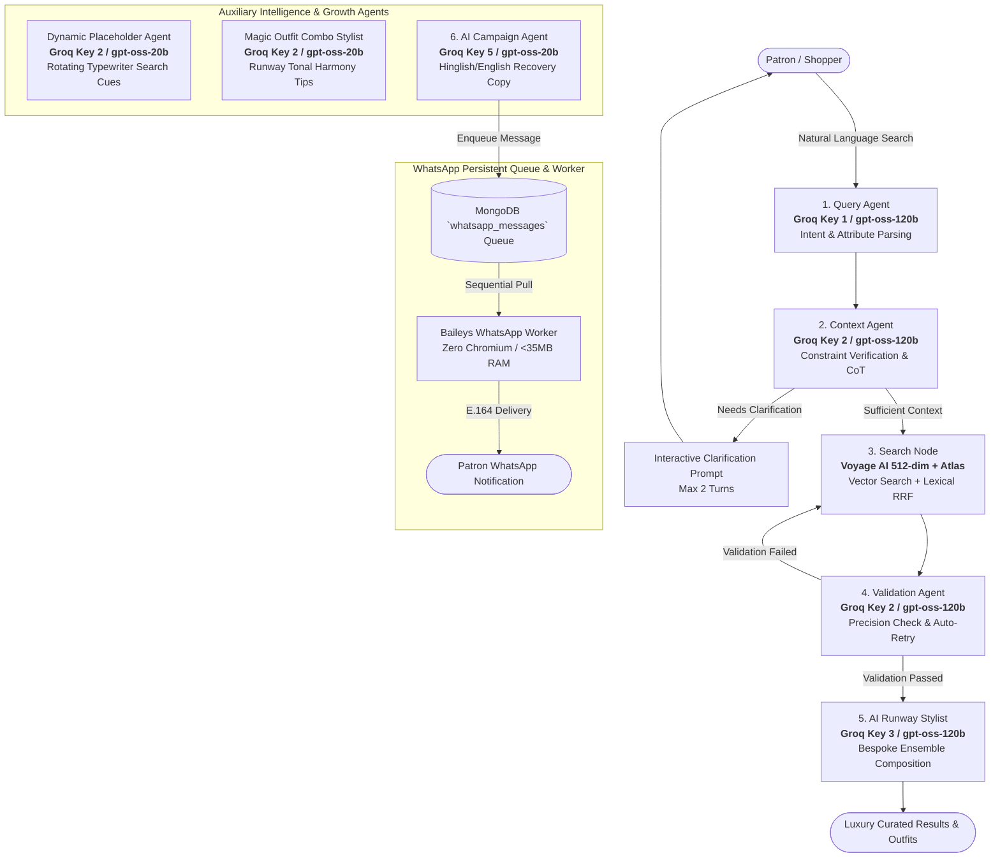

# AURA — AI-Native Luxury Fashion Concierge & Agentic Commerce Platform

[](https://ai-growth-agentic-commerce.onrender.com)
[](https://github.com/ChaitanyaJhindal/AI-Growth-Agentic-Commerce-)
[-orange?style=for-the-badge)](https://groq.com)
[](https://www.mongodb.com/atlas)
[-blueviolet?style=for-the-badge)](https://voyageai.com)

---

## 🌐 Live Deployments & Portal Links

| Service | Live URL | Description |
| :--- | :--- | :--- |
| **🛍️ Production Storefront** | [https://ai-growth-agentic-commerce.onrender.com](https://ai-growth-agentic-commerce.onrender.com) | Luxury Fashion Concierge & AI Styling Experience |
| **📊 Executive Atelier Admin** | [https://ai-growth-agentic-commerce.onrender.com/admin](https://ai-growth-agentic-commerce.onrender.com/admin) | Real-Time Revenue Analytics, Orders, & Patron Hub |
| **📱 WhatsApp QR Pairing** | [https://ai-growth-agentic-commerce.onrender.com/whatsapp](https://ai-growth-agentic-commerce.onrender.com/whatsapp) | Live Baileys Engine QR Scanner & Campaign Dispatcher |
| **💓 Keep-Alive Health Probe** | [https://ai-growth-agentic-commerce.onrender.com/health](https://ai-growth-agentic-commerce.onrender.com/health) | Uptime Monitoring & Render Keep-Alive Endpoint |

---

## 💎 Executive Overview

**AURA** is an enterprise-grade, agentic e-commerce platform that transforms luxury retail from passive browsing into an active, bespoke dialogue. Built on **LangGraph**, **Groq Distributed LLM Inference**, **Voyage AI Remote Vector Embeddings**, and **MongoDB Atlas**, AURA orchestrates 6 specialized autonomous agents to deliver sub-second search, dynamic outfit pairing, cryptographic checkout, and automated WhatsApp re-engagement.

---

## 🚀 Core Architectural Innovations



---

## ⚡ Key System Capabilities

### 1. 🤖 Multi-Agent Orchestration (LangGraph StateGraph)
* **Query Agent**: Extracts gender, category, color, season, price ceiling, and aesthetic constraints.
* **Context Agent**: Evaluates contextual sufficiency, maintaining multi-turn memory and generating focused clarification prompts when ambiguous.
* **Search Engine**: Executes dual-path hybrid search: Voyage AI vector semantic embeddings (512 dimensions) combined with MongoDB Atlas lexical text search, fused via Reciprocal Rank Fusion (RRF).
* **Validation Agent**: Performs rigorous semantic precision checks, automatically re-querying if initial candidates deviate from intent.
* **Upsell Fashion Stylist**: Synthesizes runway-level ensemble pairings with detailed tonal rationale and wearing notes.
* **Campaign & Re-Engagement Agent**: Crafts high-conversion, witty Hinglish/English promotional copy for abandoned cart recovery.

### 2. 🏷️ Luxury Checkout & Promo Voucher System
* **Real-Time Discount Calculation**: Validates promo codes (`AURA20`, `AURA25`, `VIP20`, `WELCOME10`, `RUNWAY30`) via `POST /api/coupon/validate`.
* **Dynamic Cost Breakdown**: Displays original subtotal, privilege discount amount, and total payable in real time.
* **Cryptographic Razorpay Integration**: Standard web checkout with HMAC-SHA256 signature verification.
* **Order Archiving**: Persists order manifest, applied coupon, savings, and Razorpay transaction IDs in MongoDB Atlas.

### 3. 📱 Abandoned Cart WhatsApp Pipeline (OpenWA / Baileys)
* **Zero-Chromium Architecture**: Runs on pure WebSocket-based Baileys engine consuming **<35MB RAM** (ideal for Render Free tier).
* **MongoDB Persistent Queue**: Enqueues messages to `whatsapp_messages` collection with atomic locks, retry backoffs, and E.164 normalization.
* **Session Persistence in Atlas**: Encrypted WhatsApp credentials survive container restarts without requiring QR re-pairing.
* **Intelligent Cooldown & Deduping**: Prevents customer fatigue by enforcing cooldown thresholds and automatically clearing carts upon checkout.

### 4. 📊 Executive Atelier Admin Hub
* **Live Revenue Metrics**: Gross merchandise volume (GMV), total acquisitions, registered patrons, and average order value (AOV).
* **Fulfillment Pipeline**: Real-time order manifest inspector with live status updating (`Paid`, `In Transit`, `Delivered`).
* **Patron Directory**: Complete customer profiles, saved capsule wardrobes, lifetime spend, and linked contact numbers.
* **1-Click AI Recovery Launcher**: On-demand abandoned cart campaign execution with real-time streaming execution logs.

---

## 📁 Repository Structure

```
AI Growth & Agentic Commerce/
├── data/                           # Catalog datasets & Atlas vector schema
│   ├── products_catalog.json       # Cleaned fashion catalog (44,000+ items)
│   └── atlas_vector_search_index.json
├── src/                            # Core application source code
│   ├── config.py                   # Environment & distributed Groq key routing
│   ├── auth.py                     # PBKDF2 authentication, cart & order persistence
│   ├── payments.py                 # Razorpay order generation & HMAC verification
│   ├── search/                     # Hybrid search & remote embedding engine
│   │   ├── embeddings.py           # Voyage AI remote inference (512-dim vectors)
│   │   ├── engine.py               # Hybrid Search (Vector + Text + RRF ranking)
│   │   └── indexing.py             # Atlas vector search & metadata indexing
│   ├── agents/                     # LangGraph Multi-Agent system
│   │   ├── state.py                # Pydantic schemas & unified AgentState
│   │   ├── base.py                 # Distributed LLM key routing & search engine
│   │   ├── query_agent.py          # Intent & attribute extraction
│   │   ├── context_agent.py        # Specificity check & clarification prompts
│   │   ├── search_agent.py         # Hybrid search retrieval node
│   │   ├── validation_agent.py     # Candidate validation & retry loops
│   │   ├── upsell_agent.py         # Dynamic AI Fashion Stylist & complete looks
│   │   ├── placeholder_agent.py    # Gen-Z Dynamic Placeholder & Magic Stylist
│   │   ├── campaign_agent.py       # WhatsApp & Push recovery copy generator
│   │   └── workflow.py             # LangGraph StateGraph pipeline
│   └── whatsapp/                   # WhatsApp messaging & background queue
│       ├── queue.py                # MongoDB persistent queue with atomic locking
│       ├── session_store.py        # MongoDB session persistence across restarts
│       ├── baileys_service.js      # Lightweight Baileys WebSocket service
│       ├── baileys_client.py       # IPC client communicating with Node service
│       ├── worker.py               # Background sequential dispatch worker
│       └── automation.py           # Abandoned cart campaign manager & coupon validator
├── static/                         # Frontend interfaces
│   ├── index.html                  # Luxury fashion concierge web interface
│   ├── styles.css                  # Stitch Aurelian Noir luxury design system
│   ├── app.js                      # Client state, dynamic streaming & outfit studio
│   ├── admin.html                  # Executive Atelier Admin Dashboard
│   ├── admin.js                    # Admin real-time metrics & order management
│   └── whatsapp.html               # Live QR code scanner & queue monitor
├── tests/                          # Automated test suites
│   ├── test_agents.py              # End-to-end multi-agent pipeline tests
│   ├── test_auth.py                # User authentication & order flow tests
│   ├── test_coupon_and_automation.py # Coupon validation & cart sync tests
│   ├── test_abandoned_cart_dispatch.py # AI copy synthesis & WhatsApp queue tests
│   ├── test_whatsapp_service.py    # Baileys client & queue worker tests
│   └── test_health.py              # Health check & uptime monitor tests
├── server.py                       # FastAPI Production Server
├── render.yaml                     # Render deployment manifest
├── render-build.sh                 # Fast build script
└── requirements.txt                # Pinned production dependencies
```

---

## 🛠️ REST API Reference

### 1. Catalog & Search Endpoints
| Method | Endpoint | Description |
| :--- | :--- | :--- |
| `POST` | `/api/search` | Full LangGraph multi-agent hybrid search pipeline |
| `POST` | `/api/clarify` | Resumes multi-turn conversation with user clarification |
| `POST` | `/api/outfit` | Generates dynamic outfit pairings and complete looks |
| `GET` | `/api/trending` | Retrieves editorial curated runway picks |
| `GET` | `/api/placeholder/next` | Fetches next dynamic search suggestion |

### 2. Auth, Bag & Order Endpoints
| Method | Endpoint | Description |
| :--- | :--- | :--- |
| `POST` | `/api/auth/signup` | Registers new member with password hash and phone |
| `POST` | `/api/auth/login` | Authenticates patron and returns saved collections |
| `GET` | `/api/auth/me` | Fetches user profile, wardrobe, and bag from MongoDB |
| `POST` | `/api/user/sync` | Synchronizes shopping bag and wardrobe into MongoDB |
| `POST` | `/api/coupon/validate` | Validates promo code and returns discount breakdown |
| `POST` | `/api/create-order` | Creates standard Razorpay order |
| `POST` | `/api/verify-payment` | Cryptographically verifies payment and records order |
| `GET` | `/api/user/orders` | Retrieves user's acquisition order history |

### 3. Abandoned Cart & WhatsApp Automation Endpoints
| Method | Endpoint | Description |
| :--- | :--- | :--- |
| `POST` | `/api/automation/abandoned-cart-campaign` | Scans MongoDB carts & triggers AI WhatsApp dispatch |
| `GET` | `/api/automation/abandoned-cart-stats` | Returns real-time abandoned cart metrics |
| `GET` | `/whatsapp/status` | Returns Baileys connection state and queue health |
| `GET` | `/whatsapp/qr` | Returns live WhatsApp pairing QR code |
| `POST` | `/whatsapp/queue` | Enqueues raw WhatsApp message into MongoDB queue |

---

## 💻 Local Development Setup

### 1. Clone & Install Dependencies
```bash
git clone https://github.com/ChaitanyaJhindal/AI-Growth-Agentic-Commerce-.git
cd AI-Growth-Agentic-Commerce-

# Install Python dependencies
pip install -r requirements.txt

# Install lightweight Baileys Node dependencies
npm install
```

### 2. Configure Environment (`.env`)
Create a `.env` file in the project root:
```ini
# Database & Vector Embeddings
MONGODB_URI=mongodb+srv://<user>:<password>@cluster0.gdjxqnz.mongodb.net/?appName=Cluster0
VOYAGE_API_KEY=pa-...

# Distributed Groq LLM API Keys
GROQ_API_KEY_QUERY=gsk_...
GROQ_API_KEY_CONTEXT=gsk_...
GROQ_API_KEY_VALIDATION=gsk_...
GROQ_API_KEY_UPSELL=gsk_...
GROQ_API_KEY_CAMPAIGN=gsk_...

# Payments & WhatsApp
RAZORPAY_KEY_ID=rzp_test_...
RAZORPAY_KEY_SECRET=...
ENABLE_WHATSAPP_WORKER=true
```

### 3. Launch Development Server
```bash
python server.py
```
Open **`http://127.0.0.1:8000`** in your browser.

---

## 🧪 Running Automated Test Suites

```bash
# Test 1: Coupon Validation & Cart Syncing
python tests/test_coupon_and_automation.py

# Test 2: AI Copy Synthesis & WhatsApp Queue Pipeline
python tests/test_abandoned_cart_dispatch.py

# Test 3: Multi-Agent Workflow Pipeline
python tests/test_agents.py

# Test 4: Patron Authentication & Order Flows
python tests/test_auth.py

# Test 5: Health & Keep-Alive Diagnostics
python tests/test_health.py
```

---

## 🚢 Continuous Deployment (Render)

The project is configured for continuous zero-downtime deployment on **Render**:
* **Build Command**: `./render-build.sh` (Installs pinned Python & Node dependencies)
* **Start Command**: `uvicorn server:app --host 0.0.0.0 --port $PORT`
* **Health Check & Keep-Alive**: `/health` (Monitored every 10 minutes to maintain persistent uptime)

---

## 📄 License & Attribution
Developed with ❤️ by **Chaitanya Vedansh** for the AI Growth & Agentic Commerce Initiative. Open-source under the [MIT License](LICENSE).