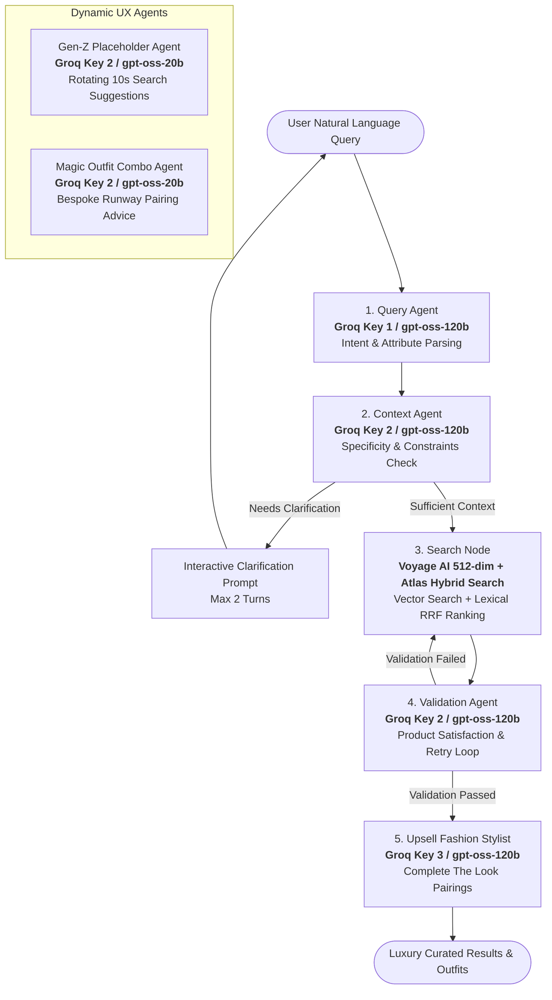

# AURA — AI-Native Luxury Fashion Concierge & Agentic Commerce System

> **🌐 Live Production Application:** [https://ai-growth-agentic-commerce.onrender.com](https://ai-growth-agentic-commerce.onrender.com)  
> **📊 Executive Atelier Admin Portal:** [https://ai-growth-agentic-commerce.onrender.com/admin](https://ai-growth-agentic-commerce.onrender.com/admin)

A multi-agent luxury e-commerce concierge powered by **LangGraph**, **Groq Distributed LLMs (`openai/gpt-oss-120b` & `openai/gpt-oss-20b`)**, **Voyage AI Remote Inference Embeddings (`voyage-3-lite`)**, and **MongoDB Atlas Hybrid Vector Search**.

---

## 🚀 Key Highlights & Agentic UX Innovations

* **⚡ Ultra-Low Latency Multi-Agent Architecture**: Built on LangGraph StateGraph with distributed Groq API keys routing specialized tasks to Query, Context, Validation, Upsell, Placeholder, and Campaign Agents.
* **🧠 Voyage AI Remote Inference (`voyage-3-lite`)**: Zero-RAM remote embedding inference with 512-dimensional normalized vectors and automatic rate-limit retry.
* **📢 AI Campaign & Re-Engagement Agent (`openai/gpt-oss-20b`)**: Crafts hyper-personalized, witty, culturally-resonant (Hinglish/English) promotional messages for WhatsApp, Push, and SMS based on items in consumer carts.
* **✨ Dynamic Streaming Placeholder Agent (`openai/gpt-oss-20b`)**: Dynamic character-by-character typewriter search bar placeholder refreshed every 10 seconds with catalog-grounded queries.
* **🪄 Magic Outfit Combo Stylist & Capsule Preview**: Synthesizes bespoke styling rationale based on your selected anchor piece and recommended upsell pieces, revealed with a silky blurry-to-sharp animation.
* **📊 Progressive Revelation Pipeline Banner**: Sequential line-by-line streaming of agent thoughts during query processing.
* **🔐 Full Authentication & Patron Wardrobe**: User registration, session persistence, saved wardrobes, and cart syncing directly to MongoDB Atlas.
* **💳 Razorpay Payment Gateway**: Seamless checkout with cryptographic HMAC-SHA256 signature verification.
* **👔 Executive Atelier Admin Portal**: Real-time sales metrics, patron directories, and order fulfillment tracking.

---

## 🤖 Agentic Architecture (LangGraph Multi-Agent Workflow)



---

## 📁 Project Structure

```
AI Growth & Agentic Commerce/
├── data/                           # Catalog datasets & Atlas index schema
│   ├── products_catalog.json       # Cleaned fashion catalog (44,000+ items)
│   └── atlas_vector_search_index.json
├── src/                            # Core application source code
│   ├── __init__.py
│   ├── config.py                   # Distributed Groq keys & Voyage AI config
│   ├── auth.py                     # User authentication & MongoDB management
│   ├── payments.py                 # Razorpay order generation & HMAC verification
│   ├── search/                     # Hybrid search & vector embedding engine
│   │   ├── __init__.py
│   │   ├── embeddings.py           # Voyage AI remote inference (512-dim vectors)
│   │   ├── engine.py               # Hybrid Search (Vector + Text + RRF ranking)
│   │   └── indexing.py             # Atlas vector search & metadata indexing
│   └── agents/                     # LangGraph Multi-Agent system
│       ├── __init__.py
│       ├── state.py                # Pydantic schemas & unified AgentState
│       ├── base.py                 # Distributed LLM key routing & search engine
│       ├── query_agent.py          # Node 1: Intent & attribute extraction
│       ├── context_agent.py        # Node 2: Context evaluation & clarification
│       ├── search_agent.py         # Node 3: Hybrid search retrieval node
│       ├── validation_agent.py     # Node 4: Product satisfaction & retry logic
│       ├── upsell_agent.py         # Node 5: AI Fashion Stylist & complete looks
│       ├── placeholder_agent.py    # Gen-Z Dynamic Placeholder & Magic Stylist
│       └── workflow.py             # LangGraph StateGraph & checkpointer
├── static/                         # Web UI frontend assets
│   ├── index.html                  # Luxury fashion concierge web interface
│   ├── styles.css                  # Modern luxury styling & micro-animations
│   ├── app.js                      # Client state, dynamic streaming & outfit studio
│   ├── admin.html                  # Executive Atelier Admin Dashboard
│   ├── admin.css                   # Admin dark luxury theme
│   └── admin.js                    # Admin real-time metrics & order management
├── tests/                          # Automated verification test suites
│   ├── test_agents.py              # End-to-end agent workflow tests
│   ├── test_conversation.py        # Multi-turn conversation persistence test
│   ├── test_placeholder_agent.py   # Placeholder & Magic Stylist agent tests
│   ├── test_auth.py                # User authentication & order flow tests
│   └── test_health.py              # Uptime health & keep-alive tests
├── server.py                       # FastAPI Web Server (http://127.0.0.1:8000)
├── agent_cli.py                    # Interactive terminal shopping assistant
├── search_cli.py                   # Direct hybrid search CLI
├── render.yaml                     # Render deployment configuration
├── render-build.sh                 # Fast lightweight build script (~20s)
└── requirements.txt                # Pinned lightweight dependencies
```

---

## ⚡ Quick Start Guide

### 1. Installation
```bash
git clone https://github.com/ChaitanyaJhindal/AI-Growth-Agentic-Commerce-.git
cd AI-Growth-Agentic-Commerce-
pip install -r requirements.txt
```

### 2. Configure Environment (`.env`)
Create a `.env` file in the project root:
```ini
MONGODB_PASSWORD=your_mongodb_password
VOYAGE_API_KEY=your_voyage_ai_key

# Distributed Multi-Key Groq Setup
GROQ_API_KEY_QUERY=gsk_...
GROQ_API_KEY_CONTEXT=gsk_...
GROQ_API_KEY_VALIDATION=gsk_...
GROQ_API_KEY_UPSELL=gsk_...

# Optional: Razorpay Payments
RAZORPAY_KEY_ID=your_razorpay_key_id
RAZORPAY_KEY_SECRET=your_razorpay_secret
```

### 3. Run Locally
```bash
python server.py
```
Open **`http://127.0.0.1:8000`** in your browser to experience the application.

---

## 🧪 Test Suites

Run automated test suites to verify system functionality:

```bash
# Test 1: Gen-Z Dynamic Placeholder & Magic Stylist Combo Agent
python tests/test_placeholder_agent.py

# Test 2: Full End-to-End Multi-Agent Pipeline
python tests/test_agents.py

# Test 3: Multi-Turn Conversation & Clarification Persistence
python tests/test_conversation.py

# Test 4: User Authentication & Profile Orders
python tests/test_auth.py

# Test 5: Health Check & Keep-Alive Uptime Routes
python tests/test_health.py

# Test 6: WhatsApp Message Queue & Baileys Worker
python tests/test_whatsapp_service.py
```

---

## 📱 Lightweight WhatsApp Messaging Service (OpenWA / Baileys Engine)

An asynchronous, MongoDB-backed persistent queue and worker for delivering personalized campaign messages without high memory consumption.

```
Campaign Agent (openai/gpt-oss-20b)
    │
    ▼
POST /whatsapp/queue (Validates E.164 phone & enqueues)
    │
    ▼
MongoDB `whatsapp_messages` collection (status: 'pending')
    │
    ▼
Lightweight Sequential Worker (Atomic claim, rate-limit spacing)
    │
    ▼
Baileys WhatsApp Engine (Zero Chromium, <35MB RAM)
    │
    ▼
WhatsApp Recipient (+9198****3210)
```

### 📋 Status State Machine:
* `pending` ➔ `processing` (atomically claimed with lock timeout)
* `processing` ➔ `sent` (delivery confirmed)
* `processing` ➔ `pending` (transient failure, increment attempts)
* `processing` ➔ `failed` (exceeded `max_attempts = 3`)

### 🔑 Key Endpoints:
* `POST /whatsapp/queue`: Enqueue a message with recipient phone in E.164 format.
* `GET /whatsapp/queue/{id}`: Inspect delivery status and retry attempts.
* `GET /whatsapp/status`: Real-time queue metrics and Baileys connection state.
* `POST /whatsapp/campaign/queue`: One-click campaign synthesis & automated queue dispatch.

### 💾 Session Persistence on Render Free:
WhatsApp credentials and keys are automatically synchronized with the MongoDB `whatsapp_sessions` collection, guaranteeing persistent authentication across ephemeral Render container restarts without requiring QR re-scanning.

---

## 🌐 Deployment

The application is deployed on **Render** with continuous deployment from the `main` branch.

* **Production URL:** [https://ai-growth-agentic-commerce.onrender.com](https://ai-growth-agentic-commerce.onrender.com)
* **Keep-Alive Uptime Ping:** `https://ai-growth-agentic-commerce.onrender.com/health` (checked every 10 minutes)